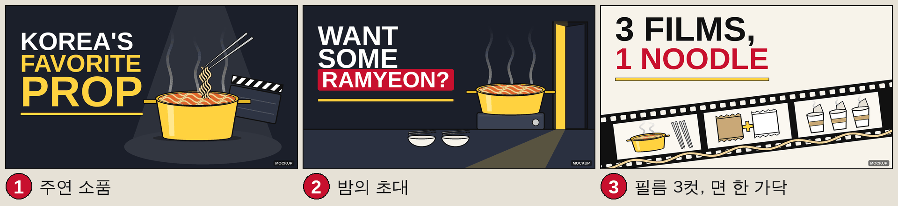

# EP001 썸네일 후보 3안

직원: designer / 기준일: 2026-10-01 / 입력: `script.en.md`(S01~S12, 제목 가안 "Why Ramyeon Keeps Showing Up on Korean Screens"), `research.md` §5 / 규칙: `design-system.md` v1.0
상태: **prompt-ready**. 이미지 생성 API 키가 없어 최종 플레이트는 미생성(pending). `thumb-1~3.png`는 Pillow로 그린 **레이아웃 목업**(색·타이포·구도 확인용, 우하단 MOCKUP 표기)이며 최종본이 아니다.
목업 검수: 1280x720 원본 + 320x180 + 168x94 축소본으로 문구 판독·잘림·대비·우하단 비움 확인 완료. 재현: `python3 episodes/EP001/design/make_thumbs.py`



| # | 컨셉 한 줄 | 텍스트(단어 수) | 지배 색 |
|---|---|---|---|
| 1 | 라면이 한국 화면의 "주연 소품": 스포트라이트 아래 냄비, 젓가락이 면을 들어 올리고 빈 슬레이트가 옆에 | `KOREA'S FAVORITE PROP` (3) | night + yellow |
| 2 | 2001년 대사 "라면 먹을래요?"의 초대: 밤 부엌, 냄비 하나와 그릇 둘, 살짝 열린 문의 불빛(인물 없음) | `WANT SOME RAMYEON?` (3) | night + red |
| 3 | 영화 3편을 한 가닥 면이 꿰뚫는다: 필름 스트립 3컷(냄비·무지 봉지 2개·컵 3개) | `3 FILMS, 1 NOODLE` (4) | paper + red |

- 세 문구 모두 제목을 반복하지 않고 보완한다. 3안의 "3 FILMS"는 사실과 일치(봄날은 간다·기생충 = 영화, KPop Demon Hunters = 애니메이션 영화).
- 진행자 얼굴이 없는 채널이라 스킬의 "얼굴 30~50%" 규칙은 "단일 사물 30~50%"로 대체했다(`design-system.md` §3).
- 운영 제안: 채널에서 YouTube 썸네일 테스트(Test & Compare)를 쓸 수 있으면 3안을 함께 올려 비교. 사용 가능 여부는 업로드 시 확인 필요.

---

## 1안: 주연 소품

- 구도: 텍스트 왼쪽 45%(3줄, PROP 최대). 냄비 오른쪽 55%, 화면 약 40%. 위에서 스포트라이트, 냄비 뒤 오른쪽에 글자 없는 슬레이트. 우하단 비움.
- 목업: `thumb-1.png`

```
YouTube thumbnail background plate, 16:9, 1280x720. A plain yellow aluminum Korean ramyeon pot
(classic thin-metal style, no markings, no embossing) full of wavy noodles in orange-red broth,
with a pair of plain stainless steel chopsticks lifting a tangle of noodles above it and soft
white steam rising. The pot sits in the right 55% of the frame and fills about 40% of the image,
lit by a single theatrical spotlight from above on a dark stage floor. A blank black-and-white
film slate with no writing leans behind the pot on the right. Dark night navy background
(#1B1F2A), vivid pot yellow (#FFD23F), small chili red (#C8102E) accents. Keep the left 45% as
empty dark background for a headline added later, and keep the bottom-right corner empty.
Flat editorial illustration, bold clean ink outlines, subtle paper grain, calm cinematic lighting.
No text, no logos, no brand packaging, no real people or faces.
```
Negative:
```
text, letters, numbers, writing on the slate, logos, brand names, trademarks, product packaging,
printed labels, real people, faces, hands, celebrity likeness, copyrighted characters, mascots,
cartoon face on the pot, anthropomorphic objects, film still, poster, watermark, UI elements,
clutter in the bottom-right corner
```

## 2안: 밤의 초대

- 구도: 텍스트 왼쪽(WANT / SOME / RAMYEON? 빨간 블록). 오른쪽에 휴대용 버너 위 냄비(초점), 앞 테이블에 그릇 2개와 젓가락 2벌, 오른쪽 끝 살짝 열린 문에서 노란 빛. 사람·실루엣 없음.
- 목업: `thumb-2.png`

```
YouTube thumbnail background plate, 16:9, 1280x720. A small, dim Korean apartment kitchen at
night, seen from the side at table height. On a plain unbranded portable tabletop gas burner
sits a yellow aluminum ramyeon pot with steam rising. Two small empty white bowls, each with a
pair of stainless steel chopsticks resting on top, wait on the table to the left, quietly
suggesting an invitation for two without showing anyone. At the far right, a front door stands
slightly ajar and warm yellow light spills across the floor. Night navy palette (#1B1F2A) with
warm yellow light (#FFD23F) and a hint of chili red (#C8102E). Keep the left 45% as an empty dark
wall for a headline added later, and keep the bottom-right corner free of detail. Original
composition, not based on any film scene. Flat editorial illustration, bold clean ink outlines,
subtle paper grain, soft white steam. No text, no logos, no brand packaging, no real people,
no silhouettes, no faces.
```
Negative:
```
text, letters, numbers, logos, brand names, trademarks, product packaging, printed labels,
readable signage, real people, silhouettes, faces, hands, couple, romantic pose, celebrity
likeness, copyrighted characters, film still recreation, poster, watermark, UI elements
```

## 3안: 필름 3컷, 면 한 가닥

- 구도: 텍스트 상단 왼쪽 2줄("3 FILMS," ink / "1 NOODLE" red). 아래로 필름 스트립이 왼쪽 아래에서 오른쪽 위로 비스듬히. 3컷 = 냄비+젓가락 2벌 / 무지 봉지 2개 + 노란 더하기 / 무지 컵 3개. 면 한 가닥이 스트립을 따라 이어짐. 우하단 비움.
- 목업: `thumb-3.png`

```
YouTube thumbnail background plate, 16:9, 1280x720. Cream paper background (#F7F3EA). A black
35mm film strip runs diagonally across the lower half, rising from lower left to the right,
with three light frames: frame 1, a small yellow aluminum pot with steam and two pairs of
chopsticks; frame 2, two plain unprinted noodle packets, one kraft brown and one off-white,
with a yellow plus sign between them; frame 3, three plain white paper cups of noodles with
lids peeled back and steam. A single golden wavy noodle strand runs along the whole strip,
connecting all three frames. Keep the top-left 60% as empty cream paper for a two-line headline
added later, and keep the bottom-right corner clear. Flat editorial illustration, bold clean
ink outlines, subtle paper grain, accents in chili red (#C8102E) and pot yellow (#FFD23F).
No text, no numbers, no logos, no brand packaging, no characters, no real people or faces.
```
Negative:
```
text, letters, numbers, frame numbers on the film, logos, brand names, trademarks, printed
packaging, red and black packets, real people, faces, anime characters, idol performers,
tiger, magpie, copyrighted characters, film stills inside the frames, red cross symbol,
poster, watermark, UI elements
```

---

## 최종본 만드는 법(생성 키 확보 후)
1. 위 프롬프트로 1280x720 이상 플레이트 생성(텍스트 없음). 모델·날짜·시드를 이 파일 하단에 기록.
2. `design-system.md` 폰트(Anton)로 문구·시그니처 바를 얹는다. 목업 좌표는 `make_thumbs.py`의 `headline()` 참고.
3. 원본·320px·168px로 재검수 후 `thumb-N.png` 교체, `thumbs-compare.png` 재생성.
