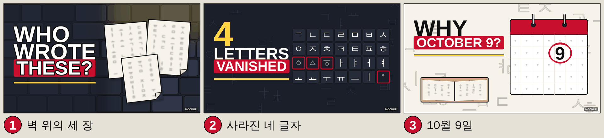

# EP002 썸네일 후보 3안

직원: designer / 기준일: 2026-10-01 / 입력: `script.en.md`(메타 "화면 원칙"·"숏폼 후보", S01~S13 화면 메모, 제목 가안 "Korea Banned Its Own Alphabet: The 580-Year Fight for Hangul") / 규칙: `/episodes/EP001/design/design-system.md` v1.0(채널 공통, 참조만·복사 안 함)
상태: **prompt-ready**. 이미지 생성 API 키가 없어 최종 플레이트는 미생성(pending). `thumb-1~3.png`는 Pillow로 그린 **레이아웃 목업**(색·타이포·구도 확인용, 우하단 MOCKUP 표기)이며 최종본이 아니다.
목업 검수: 1280x720 원본 + 320x180 + 168x94 축소본으로 문구 판독·잘림·대비·우하단 비움 확인 완료(아래 표). 재현: `python3 episodes/EP002/design/make_thumbs.py` (`--guides DIR`로 안전 영역 오버레이·축소본 출력)



| # | 컨셉 한 줄 | 텍스트(단어 수) | 지배 색 | 근거 장면 |
|---|---|---|---|---|
| 1 | 벽 위의 세 장: 1504년 밤 돌담에 붙은 익명의 종이 3장, 글자는 읽히지 않는 흐림 | `WHO WROTE THESE?` (3) | night + red | S01·S06 "three anonymous notices" |
| 2 | 사라진 네 글자: 1446년 28자 격자, 흰 24자 사이에 회색 4자(ㆁ ㅿ ㆆ ㆍ)만 빨간 테두리 | `4 LETTERS VANISHED` (3) | night + yellow/red | S04·S12 "the four in grey" |
| 3 | 10월 9일: 한지 배경 달력 한 장에 9만 크게, 그 아래 펼쳐진 옛 책(해례본 자체 일러스트) | `WHY OCTOBER 9?` (3) | paper + red | S10 "Convert that ... October 9" |

- 세 문구 모두 제목(Banned / Alphabet / 580-Year)을 반복하지 않고 보완한다. "VANISHED"는 대본 S04 "fell out of use"의 요약이며 사실과 일치(28→24). 가짜 BANNED/SECRET류 문구 없음.
- 얼굴 없는 채널 규칙(design-system §3): 초점 사물이 화면 30~50%. 목업 실측(픽셀 집계, 2026-10-01): 1안 종이 3장 바운딩 박스 512x544 = 30%(종이면 픽셀만 22%), 2안 격자 644x368 = 26%, 3안 달력 510x500 = 28%(흰 면+빨간 띠 픽셀 22%). 2·3안은 기준 하한에 조금 못 미치지만 안전 영역(사방 64px)과 우하단 배지 구역 안에서 더 키울 수 없어 이 크기로 둔다. 최종 플레이트 생성 시 프롬프트에 "fills about 35% of the frame"으로 지정.
- 자모 표기: 목업은 VM의 WenQuanYi Zen Hei(GPL-2 + font embedding exception, 목업 전용)로 그렸고 폐지 4자(ㆁ U+3181, ㅿ U+317F, ㆆ U+3186, ㆍ U+318D)를 모두 지원해 **도형 대체 불필요**. 스크립트에는 미지원 폰트용 도형 대체(`jamo_glyph()`)가 들어 있다. 최종본 KR 폰트(Black Han Sans/Pretendard, OFL)의 4자 지원 여부는 설치 후 확인, 미지원이면 Noto Sans KR(OFL) 등으로 그 4자만 대체. 대본 S04 메모의 코드포인트(ㆁ U+318D, ㆆ U+318E)는 오기 → writer에 전달.
- 운영 제안: YouTube Test & Compare를 쓸 수 있으면 3안을 함께 올려 비교(1안 호기심형 / 2안 정보형 / 3안 질문형).

## 축소본 판독 결과(목업, 2026-10-01)

| # | 1280x720 | 320x180(피드) | 168x94(추천 사이드바) | 안전 영역·우하단 | 대비(계산값) |
|---|---|---|---|---|---|
| 1 | 통과 | 3단어 판독, 종이 3장 식별 | 3단어 판독, 종이는 밝은 덩어리 3개로 식별 | 1차 렌더에서 종이 3장이 화면 20%라 280x360으로 확대, 세 번째 종이 하단이 안전선 초과해 24px 올림 → 종이 bbox x 657~1169·y 106~650 통과. 우하단 240x100 비움(돌담 배경만) | white/night 16.5 + ink 6px 외곽선, white/red 5.9 |
| 2 | 통과 | 3단어 판독, 빨간 테두리 4칸 식별 | 3단어 판독, 격자는 자모 불판독이나 빨간 4칸은 식별(의도된 결과) | 1차 렌더에서 격자 x 582~1226으로 우측 안전선 10px 초과 → 원점 572로 조정, 격자 x 572~1216·y 160~528 통과. 우하단 비움 | yellow/night 11.4, white/night 16.5, white/red 5.9 |
| 3 | 통과 | 3단어 판독, 달력의 9 판독 | 3단어 판독, 9는 빨간 링으로 위치 식별 | 1차 렌더에서 책 하단 660(안전선 656 초과)·달력 링 상단 62(64 미달) → 책 650, 달력 y 100~600으로 조정 후 통과. 우하단에는 저대비 자모 질감만 | ink/paper 17.1, white/red 5.9 |

금지 조합(yellow/red, red/night 글자) 사용 없음. 그림자·3D·그라데이션 글자 없음. 작은 글씨(부제·출처·가격) 없음.

---

## 1안: 벽 위의 세 장

- 구도: 텍스트 왼쪽 45%(WHO / WROTE 흰색 + ink 외곽선, THESE? 빨간 블록). 오른쪽 55%에 종이 3장이 겹쳐 붙음(바운딩 박스 약 30%, 최종본 35% 지정). 우상단에서 들어오는 낮은 등불 빛. 왼쪽은 어둡게 눌러 글자 바탕 확보. 인물·실루엣 없음. 우하단 비움.
- 종이 위 글자: **읽히지 않는 흐림**. 사료에 벽서 원문이 없으므로 어떤 문장도 넣지 않는다(목업은 무작위 자모 + 가우시안 블러).
- 목업: `thumb-1.png`

```
YouTube thumbnail background plate, 16:9, 1280x720. A dark stone wall of a 15th-century Korean
walled city at night, large rounded stones with deep ink outlines. Three plain sheets of cream
hanji paper (#F7F3EA) are pasted on the wall in the right 55% of the frame, overlapping at
slightly different angles, one corner folded, together filling about 35% of the image. The
sheets carry only soft, out-of-focus vertical ink marks that cannot be read, like a blurred
memory of writing, never any legible letter. A single warm lantern glow (#FFD23F) from the
upper right, the rest in deep night navy (#1B1F2A). Keep the left 45% as a calm, darker wall
for a headline added later, and keep the bottom-right corner empty. No people, no silhouettes,
no hands. Flat editorial illustration, bold clean ink outlines, subtle paper grain, calm
cinematic lighting. No text, no letters, no logos, no real people or faces.
```
Negative:
```
text, letters, numbers, readable Korean letters, readable Chinese characters, legible
handwriting, calligraphy that forms words, logos, brand names, trademarks, real people, faces,
silhouettes, hands, guards, torches held by people, blood, weapons, film still, poster,
watermark, UI elements, clutter in the bottom-right corner
```

## 2안: 사라진 네 글자

- 구도: 텍스트 왼쪽("4" 노란 대형 + LETTERS 흰색 + VANISHED 빨간 블록). 오른쪽 55%에 7x4 타일 격자(x 572~1216, y 160~528, 화면 약 26%). 타일 위 자모 28자는 **프로그램 오버레이**(흰 24, 회색 4 + 빨간 테두리). 격자 순서는 `make_thumbs.py`의 `JAMO_28`(행1 ㄱㄴㄷㄹㅁㅂㅅ / 행2 ㅇㅈㅊㅋㅌㅍㅎ / 행3 ㆁㅿㆆㅏㅑㅓㅕ / 행4 ㅗㅛㅜㅠㅡㅣㆍ). S04 모션 레이어와 좌표를 공유하면 영상 첫 컷과 썸네일이 일치한다.
- 목업: `thumb-2.png`

```
YouTube thumbnail background plate, 16:9, 1280x720. A minimal deep night navy (#1B1F2A) field
with a clean grid of 7 columns by 4 rows of empty, slightly lighter rounded square tiles in
the right 55% of the frame, like a quiet board waiting for letters, with soft inner shadows
and thin ink outlines. Three tiles in the third row (first three from the left) and the last
tile of the fourth row are outlined in chili red (#C8102E) and are darker than the others.
Very faint, out-of-focus abstract circle and stroke shapes drift in the background at low
contrast, suggesting letterforms without being any readable script. Keep the left 45% as empty
dark background for a headline added later, and keep the bottom-right corner empty. Flat
editorial illustration, bold clean ink outlines, subtle paper grain, calm cinematic lighting.
No text, no letters, no logos, no real people or faces.
```
Negative:
```
text, letters, numbers, symbols inside the tiles, keyboard, keycaps, scrabble tiles, chess
board, periodic table, logos, brand names, real people, faces, hands, film still, poster,
watermark, UI elements, clutter in the bottom-right corner
```

## 3안: 10월 9일

- 구도: 텍스트 왼쪽 상단(WHY ink + OCTOBER 9? 빨간 블록, 노란 바). 오른쪽 55%에 달력 한 장(x 690~1200, y 100~600, 화면 약 28%): 빨간 머리띠, 링 2개, 7x5 빈 격자, 2행 5열 칸에만 큰 "9"와 손그림 빨간 링 1개(남발 아님, 1개). 다른 날짜는 회색 점(작은 글씨 금지). 왼쪽 하단에 펼친 옛 책(크라프트 표지, 글자 흐림, 해례본 실물 아님). 우하단 비움.
- "9"와 다른 날짜 점은 **프로그램 오버레이**. 플레이트의 달력은 빈 격자만.
- 목업: `thumb-3.png`

```
YouTube thumbnail background plate, 16:9, 1280x720. Cream paper background (#F7F3EA) with very
faint abstract stroke shapes at low contrast like paper grain. In the right 55% of the frame,
a plain wall calendar page seen straight on: white sheet with a chili red (#C8102E) header
band, two metal rings at the top, and an empty 7 by 5 grid of thin light-grey lines with no
numbers, no weekday names and no marks, filling about 35% of the image. In the lower left,
below the headline area, a small open old book with a plain worn kraft-brown cover and cream
pages that show only soft, unreadable out-of-focus ink columns. Keep the upper left 45% empty
for a headline added later and keep the bottom-right corner empty. Flat editorial
illustration, bold clean ink outlines, subtle paper grain, calm cinematic lighting. No text,
no letters, no logos, no real people or faces.
```
Negative:
```
text, letters, numbers, weekday names, month names, readable characters on the pages,
photograph of a real museum manuscript, museum display case, national treasure plaque,
UNESCO emblem, logos, brand names, real people, faces, hands, film still, poster, watermark,
UI elements, clutter in the bottom-right corner
```

---

## 금지 항목 자가 점검(3안 공통)

| 항목 | 결과 |
|---|---|
| 실존 인물 얼굴·초상(세종 표준영정·광화문 동상·배우) | 0건. 인물·실루엣 자체가 없음 |
| 브랜드 로고·상표·특정 출판사 표지 | 0건. 책은 무지 크라프트 표지 |
| 드라마·영화 스틸·포스터 복제 | 0건 |
| 저작권 캐릭터·마스코트 | 0건 |
| 벽서 본문 문장 | 0건(무작위 자모 + 블러, 최종 프롬프트도 "cannot be read") |
| 해례본 실물 사진 | 0건(자체 일러스트) |
| 한일 비교·정치 상징·국기 | 0건 |
| 이미지 안 글자(최종 플레이트) | 0건(목업 글자는 전부 후처리 오버레이에 해당) |

## 최종본 만드는 법(생성 키 확보 후)
1. 위 프롬프트로 1280x720 이상 플레이트 생성(텍스트 없음). 모델·날짜·시드·이용약관을 `scene-prompts.md` 하단 생성 기록 표 형식으로 이 파일 끝에 기록.
2. design-system 폰트(EN Anton, KR Black Han Sans)로 문구·시그니처 바·자모(2안)·"9"(3안)를 얹는다. 좌표는 `make_thumbs.py`의 `headline()`·`thumb2()`·`calendar_page()` 참고.
3. 원본·320px·168px로 재검수 후 `thumb-N.png` 교체, `python3 make_thumbs.py --compare-only`로 `thumbs-compare.png` 재생성.

## 생성 기록 (생성 후 채움)
| 안 | 모델 | 날짜 | 시드 | 해상도 | 라이선스/이용약관 확인 | 검수자 | 비고 |
|---|---|---|---|---|---|---|---|
| 1 | | | | | | | |
| 2 | | | | | | | |
| 3 | | | | | | | |
